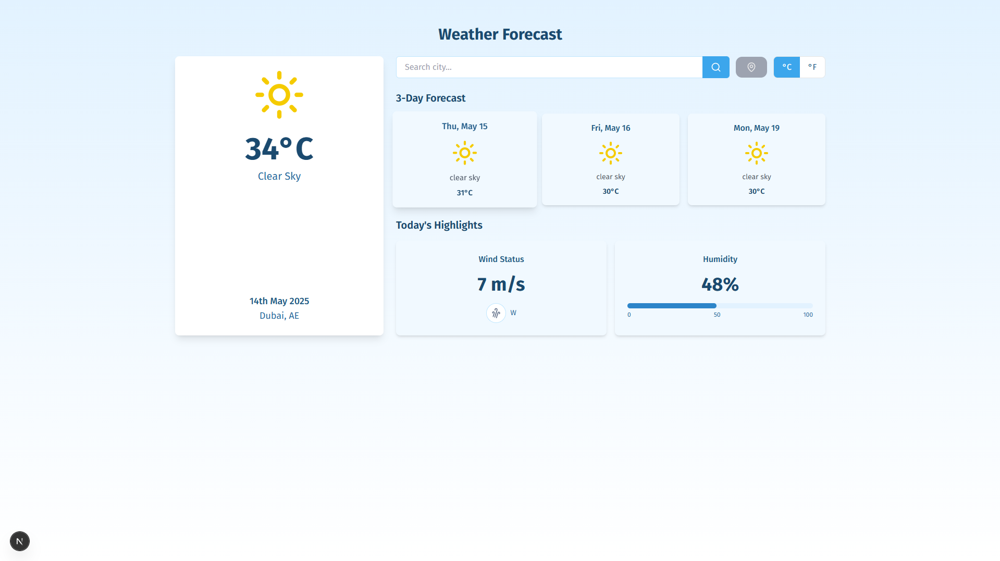
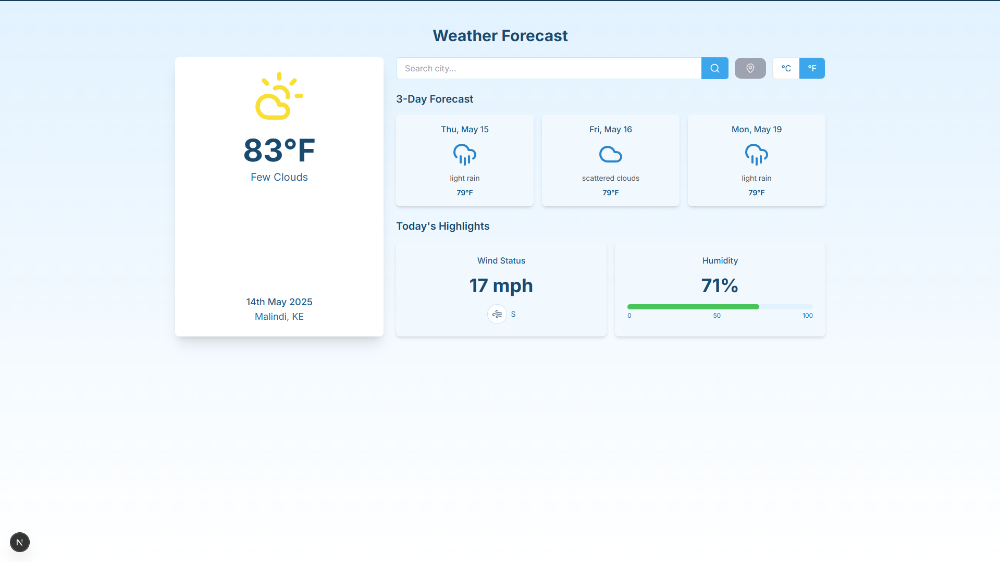

# 🌤️ Weather App

This is a decoupled weather application built using:

* **Frontend:** Next.js 14 + TypeScript + RippleUI (TailwindCSS)
* **Backend:** Laravel 11 (API Only)

---

## 🔧 Setup Instructions

### 1. Clone the Repo

```bash
git clone ...
cd weather-app
```

### 2. Install Dependencies

#### Backend

```bash
cd backend
composer install
cp .env.example .env
php artisan key:generate
```

Then add your [OpenWeatherMap API Key](https://openweathermap.org/api) to the `.env` file:

```env
OPENWEATHERMAP_API_KEY=your_key
```

#### Frontend

```bash
cd ../frontend
npm install
```

Then add the following to your `.env` file:

```env
NEXT_PUBLIC_WEATHER_API_URL=http://127.0.0.1:8000/api/weather
NEXT_PUBLIC_WEATHER_API_KEY=your_key
```

### 3. Run Both Frontend and Backend

* **On Windows:**

  Double-click `start.bat`

* **On Linux/macOS:**

  ```bash
  ./start.sh
  ```

### 4. Access the App

* Frontend: [http://localhost:3000](http://localhost:3000)
* Backend: [http://localhost:8000/api/weather](http://localhost:8000/api/weather)

---

## ✨ Features

* 🔍 City search with autocomplete (Geocoding API)
* 🌤️ Weather forecast (current + next 3 days)
* 🌡️ Switch between Celsius and Fahrenheit
* 💧 Humidity, 🌬️ wind status, and weather icons
* 📱 Fully responsive UI with RippleUI

---

## 🧠 Technical Notes

* ✅ Type-safe API and props
* ✅ Laravel backend only (no Blade views)
* ✅ Uses `fetch` in Next.js for API calls
* ✅ Modular UI components (Tailwind + RippleUI)

---

## 📸 Screenshots

> *(Add actual screenshots here as needed)*



)

---

## ✅ Submission Checklist

| Requirement                        | Done |
| ---------------------------------- | ---- |
| Laravel API only (no Blade)        | ✅    |
| Uses OpenWeatherMap API            | ✅    |
| TypeScript + Tailwind + RippleUI   | ✅    |
| City search (geocoding)            | ✅    |
| Celsius/Fahrenheit toggle          | ✅    |
| Weather details & 3-day forecast   | ✅    |
| One-command startup (nice-to-have) | ✅    |
| Good README                        | ✅    |

